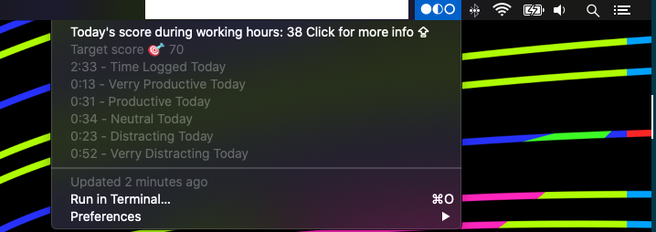

# Rescue Time Bar Plugin
This plugin gets you current productivity pulse and translates it to a 'bar' graph like so:



Circles can look like this:

● ◐ ○

Credits to for the original code and idea: https://github.com/jckyeh/bitbar-rescuetime-plugin

# Installation
1. Download the latest version of BitBar.
2. Copy it to your Applications folder and run it.
3. Follow the prompts to create and select a plugins folder.
4. Download this plugin and move to your plugins directory.
5. Create a new API key from your RescueTime account here.
6. Store the key in ~/Library/RescueTime.com/api.key.
7. Set your target in under `const goal = 70;`
8. Hit Refresh from one of the BitBar menus.

# Sidenote
The productivity date is filterd using a filter provided by Rescue time to filter on 'During working hours' (it's not well documented yet). You need a premium acount for it. Don't want the filter or want all data? Change it on line `24`

Change
```
let endpoint_today = `${ENDPOINT_ACTIVITIES}?key=${API_KEY}&perspective=interval&restrict_kind=productivity&restrict_kind=productivity&restrict_schedule_id=7304874`;
```
To
```
let endpoint_today = `${ENDPOINT_ACTIVITIES}?key=${API_KEY}&perspective=interval&restrict_kind=productivity&restrict_kind=productivity`;
```